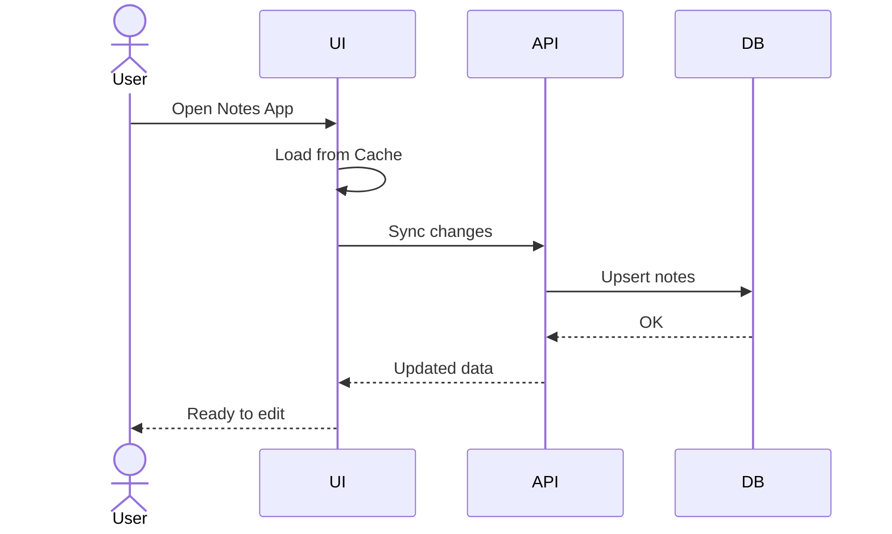
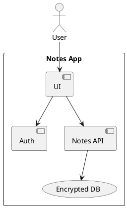

<TocSidebar />

# Notes App
Modern, fast, and minimal

<div class="mt-4 flex items-center justify-center gap-2 text-sm">
  <span class="brand-pill"><span class="brand-dot primary"></span> Primary</span>
  <span class="brand-pill"><span class="brand-dot secondary"></span> Secondary</span>
  <span class="brand-pill"><span class="brand-dot accent"></span> Accent</span>
</div>

<div @click="$slidev.nav.next" class="mt-10 py-1 px-3 rounded-md border border-gray-200 inline-block cursor-pointer" hover:bg="gray-100">
  Press Space / Right Arrow to continue <carbon:arrow-right />
</div>

<div class="abs-br m-6 text-xl">
  <a href="https://sli.dev" target="_blank" class="slidev-icon-btn"><carbon:book /></a>
  <a href="https://github.com/slidevjs/slidev" target="_blank" class="slidev-icon-btn"><carbon:logo-github /></a>
</div>

---

layout: two-cols
layoutClass: gap-12
transition: fade
---

# Why This Notes App?

- Fast capture of ideas and todos
- Clean reading and minimal distractions
- Powerful search and tags
- Offline-first and synced across devices

::right::

### Highlights
- Keyboard-first UX
- Structured content with Markdown
- Share & collaborate
- Versioning & history

<v-click>
<div class="nav-hint">
  <span>Use ↑ ↓ ← → to navigate</span>
</div>
</v-click>

---

transition: slide-up
---

# Table of Contents
A quick map of what we'll cover.

<Toc minDepth="1" maxDepth="2" />

---

layout: image-right
image: https://images.unsplash.com/photo-1497493292307-31c376b6e479?q=80&w=2280&auto=format&fit=crop
transition: slide-left
---

# Core Features

- Create, edit, delete notes
- Markdown formatting
- Tags and folders
- Full-text search
- PWA/offline
- Sync & share

<v-click>
<div class="mt-6 text-sm text-gray-600">
  Tip: Tap the bottom-left hot area for Slidev navigation UI
</div>
</v-click>

---

layout: two-cols
layoutClass: gap-10
transition: fade
---

# Demo: Quick Edit

```html
<NoteDemo />
```

<NoteDemo />

::right::

- Real-time word and char counts
- Simple tagging system
- Live preview
- Keyboard-focus friendly

---

transition: slide-up
---

# Architecture Overview

```mermaid {theme: 'neutral', scale: 0.9}
graph LR
  A[Client (Vue + Slidev demo)] -->|REST/GraphQL| B[API Gateway]
  B --> C[Auth Service]
  B --> D[Notes Service]
  D --> E[(DB)]
  A --> F[(Local Cache)]
  A --> G[PWA Service Worker]
```

- Modular services
- Local cache for offline
- Sync on reconnect
- Strong auth boundaries

---

transition: slide-left
---

# Data Model (TypeScript)

```ts {all|1-7|9-16|18-25|all}
export type NoteId = string

export interface Tag {
  id: string
  name: string
  color?: string
}

export interface Note {
  id: NoteId
  title: string
  content: string
  tags: Tag[]
  createdAt: string
  updatedAt: string
}

export interface SearchQuery {
  text?: string
  tags?: string[]
  limit?: number
  offset?: number
}
```

<<< @/snippets/external.ts#snippet

---

transition: slide-up
---

# User Flow



---

transition: fade
---

# Search and Tags

- Match by title, body
- Include/exclude by tags
- Ranked results
- Recent searches

```ts {monaco}
type Id = string

interface SearchIndexItem {
  id: Id
  title: string
  content: string
  tags: string[]
}

export function score(item: SearchIndexItem, q: string) {
  const t = q.toLowerCase()
  let s = 0
  if (item.title.toLowerCase().includes(t)) s += 2
  if (item.content.toLowerCase().includes(t)) s += 1
  if (item.tags.some(x => x.includes(t))) s += 1
  return s
}
```

---

transition: slide-left
---

# Transitions & Motion

<div
  v-motion
  :initial="{ x: -40, opacity: 0 }"
  :enter="{ x: 0, opacity: 1 }"
  class="text-5xl font-semibold"
  :style="{ color: 'var(--c-primary)' }"
>
  Smooth interactions
</div>

<div class="mt-6 w-full max-w-xl m-auto relative h-30">
  
</div>

---

transition: slide-up
---

# Code Editing and Run

Try it live below:

```ts {monaco-run}
import { version } from 'vue'

function titleCase(s: string) {
  return s.replace(/\w\S*/g, w => w[0].toUpperCase() + w.slice(1).toLowerCase())
}

console.log('Vue version:', version)
console.log(titleCase('notes app live playground'))
```

---

transition: fade
---

# Embedded Media

<Youtube id="dQw4w9WgXcQ" />

<v-click>
<div class="text-sm text-gray-500 mt-4">
  Videos and images enhance onboarding and feature demos.
</div>
</v-click>

---

transition: slide-left
layout: two-cols
layoutClass: gap-10
---

# Keyboard Shortcuts

- Cmd/Ctrl + N: New note
- Cmd/Ctrl + K: Quick search
- Cmd/Ctrl + S: Save
- Cmd/Ctrl + P: Print/Export

::right::

# Draggable Tips

<v-drag text-2xl border border-main rounded px-4 py-3>
  Move me to arrange your workspace
</v-drag>

<v-drag-arrow two-way op70 />

---

transition: slide-up
---

# Security & Privacy

- Local encryption option
- Server-side encryption at rest
- Role-based access for shared notes
- Audit trails for changes



---

transition: fade
layout: center
class: text-center
---

# Thank You

Explore the full demo and docs:
- Project Docs
- API Endpoints
- Design System Tokens

<PoweredBySlidev mt-6 />
